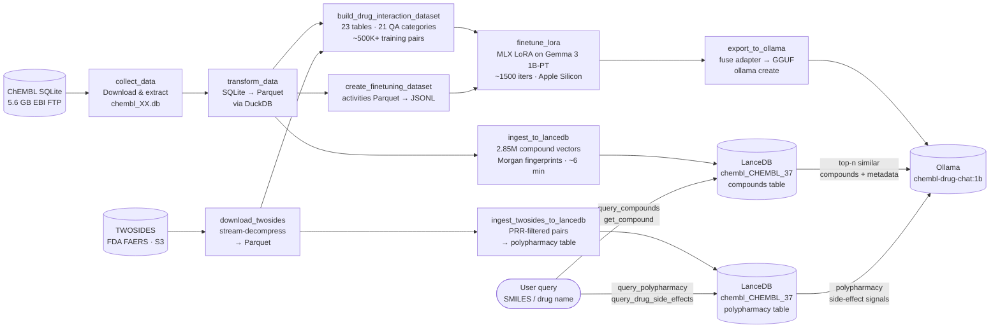

# chem_mlops

An end-to-end MLOps pipeline that fine-tunes a Gemma 3 1B language model on ChEMBL drug-interaction data, builds a 2.85 M-compound vector store for retrieval-augmented generation, and serves both models side-by-side in a streaming web chat — all running locally on Apple Silicon.

---

## Overview



The pipeline is orchestrated with **Dagster** and runs entirely locally.

---

## Requirements

| Tool | Version |
|------|---------|
| Python | ≥ 3.13 |
| [uv](https://docs.astral.sh/uv/) | any |
| [Bun](https://bun.sh) | ≥ 1.3 |
| [Ollama](https://ollama.com) | any |
| macOS + Apple Silicon | M1 / M2 / M3 |

> **Note:** The fine-tuning step uses `mlx-lm` and requires Apple Silicon. All other steps — including the web app, vector store, and evaluation — run on any platform.

---

## Installation

```bash
git clone https://github.com/AymanSulaiman/chem_mlops.git
cd chem_mlops
bash install.sh
```

`install.sh` requires macOS on Apple Silicon (arm64). It installs Homebrew (if missing), then `uv`, `bun`, and `ollama` via Homebrew, syncs Python and Bun dependencies, pulls the `gemma3:1b` base model, and runs the full Dagster pipeline end-to-end. Expect 2–3 hours on first run (ChEMBL download + fine-tuning).

**Manual setup** (if you prefer step-by-step):

```bash
brew install uv bun ollama
uv sync
cd web && bun install && cd ..
ollama pull gemma3:1b
```

Then run the pipeline manually — see [Pipeline](#pipeline) below.

---

## Pipeline

### Start the Dagster UI

```bash
dagster dev -w deployments/workspace.yaml
```

Open [http://localhost:3000](http://localhost:3000) to browse ops, trigger runs, and inspect logs. The `chembl_pipeline` job is pre-configured with a daily midnight UTC schedule.

### Run everything (headless)

```bash
uv run python -m app.orchestration.chembl_drug_chat_pipeline
```

This executes the full pipeline via Dagster:

1. Download ChEMBL SQLite archive
2. Convert all tables to Parquet
3. In parallel:
   - Download TWOSIDES polypharmacy dataset (FDA FAERS, Tatonetti et al.)
   - Build the QA JSONL dataset (ChEMBL + TWOSIDES)
   - Build the activity Parquet
   - **Ingest 2.85 M compounds into LanceDB** (vector store for RAG)
   - **Ingest TWOSIDES polypharmacy pairs into LanceDB**
4. Fine-tune Gemma 3 1B with LoRA
5. Evaluate the fine-tuned model (perplexity + golden benchmark) — gates Ollama export
6. Fuse the LoRA adapter and register the model with Ollama

### Build with the full dataset

```bash
# Step 1 — Download ChEMBL (~5.6 GB, ~5 min on a fast connection)
uv run python -m app.scripts.flows.initial_data_transformation.collect_data

# Step 2 — Convert SQLite → Parquet for all 74 tables (~10–20 min)
uv run python -m app.scripts.flows.initial_data_transformation.transform_data

# Step 3a — Build the QA finetuning dataset (~16–24 GB RAM recommended)
uv run python -m app.scripts.flows.llm_finetuning_data.build_drug_interaction_dataset

# Step 3b — Build the activity Parquet dataset
uv run python -m app.scripts.flows.llm_finetuning_data.build_finetune_dataset

# Step 3c — Ingest 2.85 M compounds into LanceDB (~6 min)
uv run python -m app.scripts.flows.vector_store.ingest_to_lancedb

# Step 3d — Download TWOSIDES from Tatonetti Lab S3 (~120 MB gzip, streamed)
uv run python -m app.scripts.flows.llm_finetuning_data.download_twosides

# Step 3e — Ingest TWOSIDES into the polypharmacy LanceDB table (run after 3c and 3d)
uv run python -m app.scripts.flows.vector_store.ingest_twosides_to_lancedb

# Step 4 — Fine-tune Gemma 3 1B (~2–4 hrs on M1 Pro)
uv run app/scripts/flows/finetuning/finetuning.py

# Step 5 — Fuse adapter, export to GGUF, and register with Ollama
uv run python -m app.scripts.flows.finetuning.export_to_ollama
```

Expected disk and time requirements:

| Step | Disk | Time (approx) |
|------|------|---------------|
| Download ChEMBL SQLite | 5.6 GB | ~5 min |
| Convert to Parquet | 8–10 GB | ~15 min |
| Build QA dataset | < 1 GB output | ~30–60 min |
| Ingest to LanceDB | ~15 GB | ~6 min |
| Download TWOSIDES | ~50 MB Parquet | ~2–3 min |
| Ingest TWOSIDES to LanceDB | < 100 MB | ~1 min |
| Fine-tune (1 500 iters) | ~2 GB adapter | ~2–4 hrs |
| Export to Ollama | ~4 GB GGUF | ~5–10 min |

> **Low-RAM machines:** Cap each table at N rows with `--row-limit`:
> ```bash
> uv run python -m app.scripts.flows.llm_finetuning_data.build_drug_interaction_dataset \
>   --row-limit 200000
> ```

---

## Web App

The repository includes a Bun chat app (`web/`) that serves both inference modes **side by side** in a single view, so you can compare answers from the fine-tuned model and the RAG pipeline on the same question simultaneously.

```
┌─────────────────────────────────────────────────────┐
│  Chem MLOps Chat                  chembl-drug-chat  │
├──────────────────────────┬──────────────────────────┤
│  Finetuned               │  RAG                     │
│  chembl-drug-chat:1b     │  gemma3:1b               │
│                          │                          │
│  [streamed response...]  │  [streamed response...]  │
│                          │                          │
├──────────────────────────┴──────────────────────────┤
│  Message both models...                      [Send] │
└─────────────────────────────────────────────────────┘
```

| Pane | Model | How it works |
|------|-------|-------------|
| **Finetuned** | `chembl-drug-chat:1b` | LoRA-tuned Gemma 3 1B; domain-aware, fast |
| **RAG** | `gemma3:1b` (base) | LanceDB context injected as system message; grounded in live ChEMBL + TWOSIDES records |

Responses stream token-by-token from Ollama and render as markdown. Each pane maintains its own independent conversation history. Sending a message fires both requests in parallel.

In RAG mode, `web/src/rag.ts` extracts drug-name candidates from the user message, queries the `compounds` and `polypharmacy` LanceDB tables via the `@lancedb/lancedb` TypeScript client (the same Lance files written by Python — no Python server needed), and prepends a context block before forwarding to Ollama.

**Start the dev server (hot reload):**

```bash
cd web
bun run dev
```

Open [http://localhost:3000](http://localhost:3000).

**Production:**

```bash
cd web
bun run start
```

**Tests:**

```bash
cd web
bun test
```

A `web/.env` file with working defaults is committed — Bun loads it automatically, no setup needed. Edit it to point at a different Ollama host, swap the RAG model, or override the LanceDB path.

---

## Vector Store (RAG)

The pipeline builds a **LanceDB vector store** alongside fine-tuning — 2,854,996 compounds from ChEMBL, each represented as a 2048-bit Morgan fingerprint (ECFP4, radius 2).

**Why RAG alongside fine-tuning?** Fine-tuning teaches the model to sound like a domain expert. It cannot guarantee factual accuracy for specific compounds. RAG grounds answers in real ChEMBL records — mechanisms, indications, warnings, metabolic enzymes — that the model only needs to format.

### Ingest

```bash
# Runs automatically as part of the Dagster pipeline, or standalone:
uv run python -m app.scripts.flows.vector_store.ingest_to_lancedb
```

Re-runs are safe — the table is always overwritten. Output: `data/lancedb/chembl_CHEMBL_37/`.

### Query — compounds

```python
from app.scripts.flows.vector_store.query_lancedb import query_compounds, get_compound

# Similarity search — top 5 compounds most similar to aspirin
hits = query_compounds("CC(=O)Oc1ccccc1C(=O)O", n=5)

# Exact lookup by ChEMBL ID
record = get_compound("CHEMBL25")
```

### Query — polypharmacy (TWOSIDES)

The `polypharmacy` table stores drug-pair adverse-event signals from TWOSIDES (Tatonetti et al., *Science Translational Medicine* 2012), derived from FDA FAERS co-reporting. Only pairs with PRR ≥ 3.0 and ≥ 5 reported cases are retained.

```python
from app.scripts.flows.vector_store.query_lancedb import query_polypharmacy, query_drug_side_effects

# Look up a specific drug pair (order-insensitive, case-insensitive)
pair = query_polypharmacy("Warfarin", "Aspirin")
# Returns dict with side_effects, max_prr, total_cases, n_side_effects — or None

# All known polypharmacy partners for a drug
pairs = query_drug_side_effects("Warfarin", n=20)
```

---

## QA Dataset

`build_drug_interaction_dataset` reads 23 ChEMBL tables plus TWOSIDES and emits 21 categories of training pairs in `### Question / ### Answer` format:

| # | Category | Source tables |
|---|----------|--------------|
| 1 | Mechanism of action | `drug_mechanism`, `target_dictionary` |
| 2 | Therapeutic indication | `drug_indication` |
| 3 | Metabolic pathways | `metabolism`, `target_dictionary` |
| 4 | Drug-drug interactions (with severity) | `metabolism` (shared CYP substrates) |
| 5 | Bioactivity potency | `activities` (pChEMBL values) |
| 6 | Drug warnings | `drug_warning` |
| 7 | Drug synonyms | `molecule_synonyms` |
| 8 | Physicochemical properties | `compound_properties` |
| 9 | ATC classification | `atc_classification`, `molecule_atc_classification` |
| 10 | Approved products | `formulations`, `products` |
| 11 | Scientific literature | `docs` |
| 12 | Assay context | `assays`, `activities` |
| 13 | Ligand efficiency | `ligand_eff`, `activities` |
| 14 | Protein target sequences | `component_sequences`, `target_components` |
| 15 | Protein family | `protein_classification`, `component_class`, `target_components` |
| 16 | Biotherapeutics | `biotherapeutics` |
| 17 | Target relations | `target_relations` |
| 18 | CYP inhibition (quantitative) | `activities`, `assays`, `target_dictionary` (IC50/Ki) |
| 19 | Pharmacodynamic interactions | `drug_mechanism`, `target_dictionary` (shared receptors) |
| 20 | P-glycoprotein transport | `activities`, `assays`, `target_dictionary` (ABCB1/MDR1) |
| 21 | Polypharmacy side effects | TWOSIDES (FDA FAERS · PRR-filtered drug-pair adverse events) |

Output: `data/llm_finetune/train.jsonl` (90%) and `valid.jsonl` (10%).

Each record:
```json
{"text": "### Question\nWhat does Aspirin target?\n\n### Answer\nAspirin (CHEMBL25) inhibits Cyclooxygenase-1 ..."}
```

**CLI options:**

```bash
uv run python -m app.scripts.flows.llm_finetuning_data.build_drug_interaction_dataset \
  [--data-dir PATH]   # default: data/chembl_transform
  [--output-dir PATH] # default: data/llm_finetune
  [--row-limit N]     # cap every table at N rows (useful on low-RAM machines)
  [--workers N]       # parallel generator processes (default: CPU count)
```

---

## Fine-tuning

Fine-tuning runs `mlx-lm` LoRA on **Gemma 3 1B** (`google/gemma-3-1b-pt`), optimised for Apple Silicon unified memory:

| Parameter | Value |
|-----------|-------|
| Method | LoRA |
| Layers | 16 of 18 |
| Batch size | 4 |
| Iterations | 1 500 |
| Learning rate | 1e-5 |
| Max sequence length | 2 048 |
| Quantisation | 4-bit (q-group 64) |
| Gradient checkpointing | ✓ |

Artifacts are written to `artifacts/<timestamp>/`:

```
artifacts/20260403_220717/
├── mlx/gemma-3-1b-pt-mlx/                   # quantised base model
└── adapters/gemma3-1b-pt-chembl-toon/        # LoRA adapter weights
```

---

## Model Evaluation

After fine-tuning, an evaluation step runs automatically before Ollama export:

- **Perplexity** on `valid.jsonl`
- **Golden benchmark** — 20 curated drug-interaction questions with keyword-match scoring
- **RAG vs fine-tuned benchmark** — same golden set run against both modes, `winner` + `delta_description` fields

Results are written to `data/eval/<run>/`:

```
data/eval/<run>/
├── finetuned_eval_metrics.json         # perplexity + exact-match %
├── finetuned_golden_results.jsonl      # per-question scores
└── <ft>_vs_<rag>_benchmark.json       # head-to-head comparison
```

The Dagster pipeline gates Ollama export on eval passing. To run evaluation standalone:

```bash
uv run python -m app.scripts.flows.eval.eval_finetuned_model
```

---

## Loading into Ollama

```bash
brew install ollama

# Auto-detect the latest fine-tuning run and export:
uv run python -m app.scripts.flows.finetuning.export_to_ollama

# Target a specific run:
uv run python -m app.scripts.flows.finetuning.export_to_ollama \
  --run-dir artifacts/20260403_220717

# Force-overwrite an existing export:
uv run python -m app.scripts.flows.finetuning.export_to_ollama --force
```

The export script fuses the LoRA adapter, converts to GGUF via llama.cpp, writes a Modelfile, and registers with Ollama. The llama.cpp conversion script is cached at `~/.cache/chem_mlops/convert_hf_to_gguf.py` on first run.

**Chat directly via Ollama:**

```bash
ollama run chembl-drug-chat:1b
```

Example questions:

```
>>> What does Aspirin target?
>>> How is Warfarin metabolised?
>>> What are the black box warnings for Methotrexate?
>>> Which drugs share the CYP2C9 metabolic pathway with Warfarin?
>>> What is the ligand efficiency of Imatinib?
>>> Is Adalimumab a small molecule or a biologic?
```

---

## Project structure

```
chem_mlops/
├── .github/workflows/ci.yml               # Lint + typecheck + pytest + bun test on every push/PR
├── app/
│   ├── orchestration/
│   │   └── chembl_drug_chat_pipeline.py   # Dagster pipeline (@op / @graph / Definitions)
│   ├── scripts/flows/
│   │   ├── initial_data_transformation/
│   │   │   ├── collect_data.py            # Download ChEMBL SQLite
│   │   │   └── transform_data.py          # SQLite → Parquet (DuckDB)
│   │   ├── llm_finetuning_data/
│   │   │   ├── build_drug_interaction_dataset.py  # 21-category QA builder (parallel)
│   │   │   ├── build_finetune_dataset.py          # Activity Parquet → JSONL
│   │   │   └── download_twosides.py               # Stream-download TWOSIDES → Parquet
│   │   ├── finetuning/
│   │   │   ├── finetuning.py              # MLX LoRA fine-tuning
│   │   │   └── export_to_ollama.py        # Fuse adapter → GGUF → Ollama
│   │   ├── eval/
│   │   │   ├── eval_finetuned_model.py    # Perplexity + golden benchmark (gates export)
│   │   │   ├── benchmark_rag_vs_finetuned.py  # Head-to-head RAG vs fine-tuned
│   │   │   └── golden.jsonl               # 20 curated drug-interaction questions
│   │   └── vector_store/
│   │       ├── ingest_to_lancedb.py       # 2.85 M compounds → Morgan fingerprints → LanceDB
│   │       ├── ingest_twosides_to_lancedb.py  # TWOSIDES → polypharmacy table
│   │       └── query_lancedb.py           # query_compounds / get_compound / polypharmacy API
│   └── tests/                             # pytest suite for each pipeline stage
├── web/                                   # Bun chat app
│   ├── src/
│   │   ├── app.ts                         # Request handler, Ollama streaming proxy, model detection
│   │   ├── rag.ts                         # Drug candidate extraction, LanceDB context builder
│   │   ├── frontend.ts                    # Side-by-side chat UI, parallel streaming, per-pane history
│   │   └── frontend-helpers.ts            # renderMarkdown, formatReplyText (no DOM deps, testable)
│   ├── public/
│   │   ├── index.html                     # Dual-pane layout (Finetuned | RAG)
│   │   └── style.css
│   ├── test/                              # bun test suite
│   └── server.ts                          # Bun.serve entry point + frontend build step
├── data/
│   ├── chembl_transform/                  # Parquet files (one per ChEMBL table)
│   ├── llm_finetune/                      # train.jsonl / valid.jsonl
│   ├── lancedb/chembl_CHEMBL_37/          # compounds (2,854,996 vectors) + polypharmacy tables
│   └── twosides/TWOSIDES.parquet          # PRR-filtered FAERS pairs (~50 MB, gitignored)
├── deployments/workspace.yaml             # Dagster code-location config
├── artifacts/                             # Fine-tuning run outputs (gitignored)
├── install.sh                             # One-command installer for Apple Silicon Macs
└── pyproject.toml
```

---

## Development

```bash
# Python tests
uv run pytest

# Lint
uv run ruff check .

# Type check
uv run ty check

# Web tests
cd web && bun test
```

All checks run automatically on every push and pull request via `.github/workflows/ci.yml`.

---

## Data sources

- **ChEMBL** — European Bioinformatics Institute. [ebi.ac.uk/chembl](https://www.ebi.ac.uk/chembl/)
- **TWOSIDES** — Tatonetti et al., *Science Translational Medicine* 2012. Drug-pair adverse event signals derived from FDA FAERS co-reporting, hosted by the Tatonetti Lab at Columbia University.
