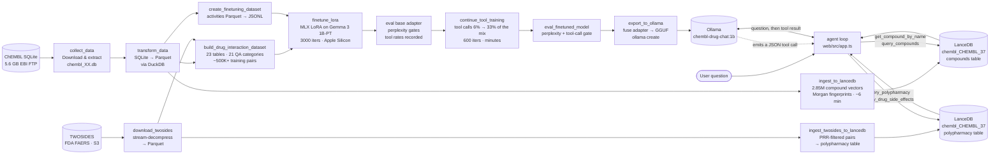

# chem_mlops

An end-to-end MLOps pipeline that fine-tunes a Gemma 3 1B language model on ChEMBL drug-interaction data, builds a 2.85 M-compound vector store, and serves the model as a **tool-calling agent** in a streaming web chat — all running locally on Apple Silicon.

The model does not have context injected into its prompt. It asks for the lookups it needs, the server runs them against LanceDB, and the results come back into the conversation.

---

## Overview


```mermaid
flowchart LR
    EBI[(ChEMBL SQLite\n5.6 GB EBI FTP)] --> COL[collect_data\nDownload & extract\nchembl_XX.db]
    COL --> TRF[transform_data\nSQLite → Parquet\nvia DuckDB]

    S3[(TWOSIDES\nFDA FAERS · S3)] --> DLT[download_twosides\nstream-decompress\n→ Parquet]

    TRF --> DDI[build_drug_interaction_dataset\n23 tables · 21 QA categories\n~500K+ training pairs]
    DLT --> DDI
    TRF --> FDS[create_finetuning_dataset\nactivities Parquet → JSONL]
    TRF --> ING[ingest_to_lancedb\n2.85M compound vectors\nMorgan fingerprints · ~6 min]

    ING --> LDB[(LanceDB\nchembl_CHEMBL_37\ncompounds table)]
    DLT --> ING2[ingest_twosides_to_lancedb\nPRR-filtered pairs\n→ polypharmacy table]
    ING2 --> LDB2[(LanceDB\nchembl_CHEMBL_37\npolypharmacy table)]

    DDI --> FT[finetune_lora\nMLX LoRA on Gemma 3 1B-PT\n3000 iters · Apple Silicon]
    FDS --> FT

    FT --> EVB[eval base adapter\nperplexity gates\ntool rates recorded]
    EVB --> CTT[continue_tool_training\ntool calls 6% → 33% of the mix\n600 iters · minutes]
    CTT --> EVL[eval_finetuned_model\nperplexity + tool-call gate]
    EVL --> EXP[export_to_ollama\nfuse adapter → GGUF\nollama create]
    EXP --> OLL[(Ollama\nchembl-drug-chat:1b)]

    USR([User question]) --> AGT[agent loop\nweb/src/app.ts]
    AGT <-->|question, then tool result| OLL
    OLL -.->|emits a JSON tool call| AGT
    AGT -->|get_compound_by_name\nquery_compounds| LDB
    AGT -->|query_polypharmacy\nquery_drug_side_effects| LDB2
    LDB --> AGT
    LDB2 --> AGT
```

The pipeline is orchestrated with **Dagster** and runs entirely locally.

---

## Requirements

| Tool | Version |
|------|---------|
| Python | ≥ 3.13 |
| [uv](https://docs.astral.sh/uv/) | any |
| [Bun](https://bun.sh) | ≥ 1.3 |
| [Ollama](https://ollama.com) | any |
| macOS + Apple Silicon | M1 / M2 / M3 |

> **Note:** The fine-tuning step uses `mlx-lm` and requires Apple Silicon. All other steps — including the web app, vector store, and evaluation — run on any platform.

---

## Installation

```bash
git clone https://github.com/AymanSulaiman/chem_mlops.git
cd chem_mlops
bash install.sh
```

`install.sh` requires macOS on Apple Silicon (arm64). It installs Homebrew (if missing), then `uv`, `bun`, and `ollama` via Homebrew, syncs Python and Bun dependencies, pulls the `gemma3:1b` base model, and runs the full Dagster pipeline end-to-end. Expect 2–3 hours on first run (ChEMBL download + fine-tuning).

**Manual setup** (if you prefer step-by-step):

```bash
brew install uv bun ollama
uv sync
cd web && bun install && cd ..
ollama pull gemma3:1b
```

Then run the pipeline manually — see [Pipeline](#pipeline) below.

---

## Pipeline

### Start the Dagster UI

```bash
dagster dev -w deployments/workspace.yaml
```

Open [http://localhost:3000](http://localhost:3000) to browse ops, trigger runs, and inspect logs. The `chembl_pipeline` job is pre-configured with a daily midnight UTC schedule.

### Run everything (headless)

```bash
uv run python -m app.orchestration.chembl_drug_chat_pipeline
```

This executes the full pipeline via Dagster:

1. Download ChEMBL SQLite archive
2. Convert all tables to Parquet
3. In parallel:
   - Download TWOSIDES polypharmacy dataset (FDA FAERS, Tatonetti et al.)
   - Build the QA JSONL dataset (ChEMBL + TWOSIDES)
   - Build the activity Parquet
   - **Ingest 2.85 M compounds into LanceDB** (vector store behind the agent's tools)
   - **Ingest TWOSIDES polypharmacy pairs into LanceDB**
4. Fine-tune Gemma 3 1B with LoRA
5. **Evaluate the base adapter** — perplexity gates; golden and tool rates recorded only
6. **Continue that adapter on a tool-heavy mix** — minutes, into its own `<stamp>_tools` run
7. Evaluate the tool-trained model (perplexity + golden + tool-call) — gates Ollama export
8. Fuse the LoRA adapter and register the model with Ollama

Steps 4–8 pass the run directory explicitly between the ops. They used to each
look up "the latest run in `artifacts/`", which meant anything else writing
there could gate on one model and ship another.

**Why the base adapter is evaluated too** (step 5): without it, a bad number at
step 7 has two suspects — the base run or the continuation — and no way to tell
them apart once the run directory is gone. It also answers whether continued
training is earning its place, on every run rather than as a special
investigation. Its golden and tool-call gates are both disabled (thresholds of `0`):
that adapter carries tool records at ~6% of its mix and is not expected to clear
a tool-call or a lookup-dependent bar, and stopping the pipeline on a model
nobody ships is the mistake the golden gate used to make. Perplexity still gates there — continuing from a
regressed adapter is pointless, and it is better to find out before spending the
continuation.

**Nothing reaches Ollama before the gate.** `gemma3_chembl_toon_finetune_flow`
exports when run standalone, and the pipeline passes `export=False` so the only
model published is the tool-trained one, after step 7 passes.

### Build with the full dataset

```bash
# Step 1 — Download ChEMBL (~5.6 GB, ~5 min on a fast connection)
uv run python -m app.scripts.flows.initial_data_transformation.collect_data

# Step 2 — Convert SQLite → Parquet for all 74 tables (~10–20 min)
uv run python -m app.scripts.flows.initial_data_transformation.transform_data

# Step 3a — Build the QA finetuning dataset (~16–24 GB RAM recommended)
uv run python -m app.scripts.flows.llm_finetuning_data.build_drug_interaction_dataset

# Step 3b — Build the activity Parquet dataset
uv run python -m app.scripts.flows.llm_finetuning_data.build_finetune_dataset

# Step 3c — Ingest 2.85 M compounds into LanceDB (~6 min)
uv run python -m app.scripts.flows.vector_store.ingest_to_lancedb

# Step 3d — Download TWOSIDES from Tatonetti Lab S3 (~120 MB gzip, streamed)
uv run python -m app.scripts.flows.llm_finetuning_data.download_twosides

# Step 3e — Ingest TWOSIDES into the polypharmacy LanceDB table (run after 3c and 3d)
uv run python -m app.scripts.flows.vector_store.ingest_twosides_to_lancedb

# Step 4 — Fine-tune Gemma 3 1B (~2–4 hrs on M1 Pro).
# Run standalone this also exports to Ollama when it finishes. The Dagster
# pipeline passes export=False so nothing is published before the gate.
uv run python -m app.scripts.flows.finetuning.finetuning

# Step 4b — Measure the base adapter before continuing, so a bad number later
# has one suspect rather than two. Thresholds of 0 record without gating.
uv run python -m app.scripts.flows.eval.eval_finetuned_model \
  --run-dir artifacts/<stamp> --tool-call-threshold 0 --pass-threshold 0

# Step 5 — Continue that adapter on a tool-heavy mix (~minutes). The quantised
# base model is symlinked, not copied, so this costs megabytes not gigabytes.
# The full run's 60 K tool-call records compete with ~900 K prose ones answering
# the same questions from memory; this retrains on a mix where tool calls are a
# third of what the model sees. Writes a new artifacts/<stamp>_tools run and
# leaves the adapter it started from untouched.
uv run python -m app.scripts.flows.finetuning.continue_tool_training

# Step 6 — Evaluate the tool-trained run. This is the gate: it blocks the export
# on a perplexity regression or a tool-call parse rate below threshold.
uv run python -m app.scripts.flows.eval.eval_finetuned_model \
  --run-dir artifacts/<stamp>_tools

# Step 7 — Fuse adapter, export to GGUF, and register with Ollama.
# Pass the run you evaluated — otherwise this exports whichever run sorts last.
uv run python -m app.scripts.flows.finetuning.export_to_ollama \
  --run-dir artifacts/<stamp>_tools
```

Expected disk and time requirements:

| Step | Disk | Time (approx) |
|------|------|---------------|
| Download ChEMBL SQLite | 5.6 GB | ~5 min |
| Convert to Parquet | 8–10 GB | ~15 min |
| Build QA dataset | < 1 GB output | ~30–60 min |
| Ingest to LanceDB | ~15 GB | ~6 min |
| Download TWOSIDES | ~50 MB Parquet | ~2–3 min |
| Ingest TWOSIDES to LanceDB | < 100 MB | ~1 min |
| Fine-tune (3 000 iters) | ~2 GB adapter | ~2–4 hrs |
| Evaluate base adapter | < 1 MB | ~10–15 min |
| Continue on tool mix (600 iters) | ~141 MB mix + 6 × ~10 MB checkpoints | ~5–15 min |
| Evaluate tool-trained adapter | < 1 MB | ~10–15 min |
| Export to Ollama | ~4 GB GGUF | ~5–10 min |

> **Low-RAM machines:** Cap each table at N rows with `--row-limit`:
> ```bash
> uv run python -m app.scripts.flows.llm_finetuning_data.build_drug_interaction_dataset \
>   --row-limit 200000
> ```

---

## Web App

The repository includes a Bun chat app (`web/`): a single agentic pane where the fine-tuned model answers with **tools**. It asks for a ChEMBL or TWOSIDES lookup, the server runs it against LanceDB, and the result comes back into the conversation — nothing is injected unless a tool asked for it.

```
┌─────────────────────────────────────────────────────┐
│  Chem MLOps Chat        chembl-drug-chat:1b · tags  │
├─────────────────────────────────────────────────────┤
│                    What is the MW of Aspirin?  [me] │
│                                                     │
│  get_compound_by_name({"name":"Aspirin"})           │
│  {"chembl_id":"CHEMBL25","mw_freebase":180.16,...}  │
│                                                     │
│  Aspirin (CHEMBL25) has a molecular weight of       │
│  180.16, formula C9H8O4.                            │
├─────────────────────────────────────────────────────┤
│  Ask about a drug, an interaction, or a structure…  │
└─────────────────────────────────────────────────────┘
```

| Tool | Backed by |
|------|-----------|
| `get_compound_by_name` | LanceDB `compounds` |
| `query_polypharmacy` / `query_drug_side_effects` | LanceDB `polypharmacy` (TWOSIDES) |
| `draw_molecule` | ChEMBL structure → RDKit `Draw.MolToImage` → PNG in the chat |
| `query_compounds` | Morgan-fingerprint similarity search — callable, but **not advertised to the model** (see below) |

The first four are the existing functions in `app/scripts/flows/vector_store/query_lancedb.py`, reached through the `app.scripts.flows.vector_store.tools` CLI. Ollama refuses its native `tools` field for this model (Gemma 3 has no tool template), so tool calls are emitted as bare JSON and parsed out of the reply. Each tool call and its result render as their own bubble, so the lookup is visible.

**The model is sent no system prompt.** Its training records are bare `### Question` / `### Answer` pairs with no tool list, so prepending one at inference is out-of-distribution text it copies from rather than reasons over — every "is it safe to take X with Y?" collapsed onto whichever tool example sat last in the list. Removing the system prompt took tool routing from 50% to 100% on held-out drugs. `query_compounds` is excluded for the same reason: it is the one tool with no training records, and advertising it made the model copy its example SMILES verbatim for unrelated questions. Both findings are recorded in ROADMAP item 3.

A near-miss tool name or argument key (`query_compound`, `drug_name` where the tool wants `name`) is mapped onto the real registry by `resolve_tool_call`, mirrored in `web/src/tools.ts` so the served behaviour and the measured behaviour cannot drift.

**Start the dev server (hot reload):**

```bash
cd web
bun run dev
```

Open [http://localhost:3000](http://localhost:3000).

**Production:**

```bash
cd web
bun run start
```

**Tests:**

```bash
cd web
bun test
```

A `web/.env` file with working defaults is committed — Bun loads it automatically, no setup needed. Edit it to point at a different Ollama host or override the model prefix.

---

## Vector Store

The pipeline builds a **LanceDB vector store** alongside fine-tuning — every molecule in ChEMBL, each small molecule represented as a 2048-bit Morgan fingerprint (ECFP4, radius 2).

**Biologics are in the table too, without a fingerprint.** Antibodies,
oligonucleotides and cell therapies have no SMILES, so they cannot be
fingerprinted — but they are real drugs with mechanisms, targets and
indications, and the name-lookup tools need to reach them. They are stored with
a zero vector and `has_structure = False`; `query_compounds` filters on that
flag, so a structureless row can never surface as a spurious "similar compound".
`draw_molecule` says so plainly rather than failing on a missing structure.

Excluding them used to mean no tool could answer a question about one — 15 of
the 40 drugs in the golden benchmark were simply unreachable. The old filter
also dropped ~22 K `structure_type = 'BOTH'` molecules, which *do* carry
structures and belong in similarity search.

**Why a vector store alongside fine-tuning?** Fine-tuning teaches the model to sound like a domain expert. It cannot guarantee factual accuracy for specific compounds. The store is what the agent's tools read, grounding answers in real ChEMBL records — mechanisms, indications, warnings, metabolic enzymes — that the model only needs to format.

### Ingest

```bash
# Runs automatically as part of the Dagster pipeline, or standalone:
uv run python -m app.scripts.flows.vector_store.ingest_to_lancedb
```

Re-runs are safe — the table is always overwritten. Output: `data/lancedb/chembl_CHEMBL_37/`.

> **A store built before the `has_structure` column needs re-ingesting.**
> `query_compounds` filters on that column, and LanceDB errors on an unknown
> field rather than ignoring it, so similarity search fails against an older
> table until this runs. Name lookups are unaffected.

### Query — compounds

```python
from app.scripts.flows.vector_store.query_lancedb import query_compounds, get_compound

# Similarity search — top 5 compounds most similar to aspirin
hits = query_compounds("CC(=O)Oc1ccccc1C(=O)O", n=5)

# Exact lookup by ChEMBL ID
record = get_compound("CHEMBL25")
```

### Query — polypharmacy (TWOSIDES)

The `polypharmacy` table stores drug-pair adverse-event signals from TWOSIDES (Tatonetti et al., *Science Translational Medicine* 2012), derived from FDA FAERS co-reporting. Only pairs with PRR ≥ 3.0 and ≥ 5 reported cases are retained.

```python
from app.scripts.flows.vector_store.query_lancedb import query_polypharmacy, query_drug_side_effects

# Look up a specific drug pair (order-insensitive, case-insensitive)
pair = query_polypharmacy("Warfarin", "Aspirin")
# Returns dict with side_effects, max_prr, total_cases, n_side_effects — or None

# All known polypharmacy partners for a drug
pairs = query_drug_side_effects("Warfarin", n=20)
```

---

## QA Dataset

`build_drug_interaction_dataset` reads 23 ChEMBL tables plus TWOSIDES and emits 22 categories of training pairs in `### Question / ### Answer` format:

| # | Category | Source tables |
|---|----------|--------------|
| 1 | Mechanism of action | `drug_mechanism`, `target_dictionary` |
| 2 | Therapeutic indication | `drug_indication` |
| 3 | Metabolic pathways | `metabolism`, `target_dictionary` |
| 4 | Drug-drug interactions (with severity) | `metabolism` (shared CYP substrates) |
| 5 | Bioactivity potency | `activities` (pChEMBL values) |
| 6 | Drug warnings | `drug_warning` |
| 7 | Drug synonyms | `molecule_synonyms` |
| 8 | Physicochemical properties | `compound_properties` |
| 9 | ATC classification | `atc_classification`, `molecule_atc_classification` |
| 10 | Approved products | `formulations`, `products` |
| 11 | Scientific literature | `docs` |
| 12 | Assay context | `assays`, `activities` |
| 13 | Ligand efficiency | `ligand_eff`, `activities` |
| 14 | Protein target sequences | `component_sequences`, `target_components` |
| 15 | Protein family | `protein_classification`, `component_class`, `target_components` |
| 16 | Biotherapeutics | `biotherapeutics` |
| 17 | Target relations | `target_relations` |
| 18 | CYP inhibition (quantitative) | `activities`, `assays`, `target_dictionary` (IC50/Ki) |
| 19 | Pharmacodynamic interactions | `drug_mechanism`, `target_dictionary` (shared receptors) |
| 20 | P-glycoprotein transport | `activities`, `assays`, `target_dictionary` (ABCB1/MDR1) |
| 21 | Polypharmacy side effects | TWOSIDES (FDA FAERS · PRR-filtered drug-pair adverse events) |
| 22 | Tool calls | question → JSON tool call → tool result → answer, over categories 1/8/21 |

Category 22 teaches the agent behaviour: each record carries both turns — the
call the model should emit, and the prose answer it should give once the result
comes back — laid out byte-identically to what the server sends at inference.

**Molecules are held out before generation.** 200 ChEMBL IDs are excluded from
every generator, and `golden.jsonl` is rebuilt from exactly those molecules in
the same run, so the benchmark and the training set cannot drift into overlap.
The holdout lands in `data/llm_finetune/holdout.json`.

Output: `data/llm_finetune/train.jsonl` (90%) and `valid.jsonl` (10%).

Each record:
```json
{"text": "### Question\nWhat does Aspirin target?\n\n### Answer\nAspirin (CHEMBL25) inhibits Cyclooxygenase-1 ..."}
```

**CLI options:**

```bash
uv run python -m app.scripts.flows.llm_finetuning_data.build_drug_interaction_dataset \
  [--data-dir PATH]   # default: data/chembl_transform
  [--output-dir PATH] # default: data/llm_finetune
  [--row-limit N]     # cap every table at N rows (useful on low-RAM machines)
  [--workers N]       # parallel generator processes (default: CPU count)
```

---

## Fine-tuning

Fine-tuning runs `mlx-lm` LoRA on **Gemma 3 1B** (`google/gemma-3-1b-pt`), optimised for Apple Silicon unified memory:

| Parameter | Value |
|-----------|-------|
| Method | LoRA |
| Layers | 16 of 18 |
| Batch size | 2 |
| Iterations | 3 000 |
| Learning rate | 1e-5 |
| Max sequence length | 2 048 |
| Quantisation | 4-bit (q-group 64) |
| Gradient checkpointing | ✓ |

Artifacts are written to `artifacts/<timestamp>/`:

```
artifacts/20260403_220717/
├── mlx/gemma-3-1b-pt-mlx/                   # quantised base model
└── adapters/gemma3-1b-pt-chembl-toon/        # LoRA adapter weights
```

### Continuing a run on tool calls

A full run trains ~950 K records, in which the 60 K tool-call examples compete
with ~900 K prose ones answering the same question shapes from memory.
`continue_tool_training.py` does the cheap experiment instead: it continues an
existing adapter on a mix where tool calls are a third of what the model sees,
writing to a **new** run directory so the source adapter is untouched.

```bash
uv run python -m app.scripts.flows.finetuning.continue_tool_training

# Build the mix and stop, to inspect it:
uv run python -m app.scripts.flows.finetuning.continue_tool_training --mix-only
```

Minutes rather than hours. Measure before exporting — it skips the export step
deliberately:

```bash
uv run python -m app.scripts.flows.eval.eval_finetuned_model --run-dir <new run>
```

### Rebuilding the agent end to end

The Dagster pipeline runs all of this (steps 4–7 above). Do it by hand when you
already have the dataset and only the adapters are missing — `artifacts/` is
gitignored, so a fresh clone or a lost run directory needs the sequence without
re-downloading ChEMBL. `data/llm_finetune/` is the expensive input and is reused.

```bash
# 1. Full LoRA run (~2-4 hrs). Skip if you still have an adapter to continue from.
uv run python -m app.scripts.flows.finetuning.finetuning

# 2. Continue it on the tool-heavy mix (minutes). Writes artifacts/<stamp>_tools.
uv run python -m app.scripts.flows.finetuning.continue_tool_training

# 3. Measure. One at a time — see the warning under Model Evaluation.
uv run python -m app.scripts.flows.eval.eval_finetuned_model \
  --run-dir artifacts/<stamp>_tools

# 4. Export the adapter you measured, so the served model is the measured model.
uv run python -m app.scripts.flows.finetuning.export_to_ollama \
  --run-dir artifacts/<stamp>_tools
```

**What step 3 should print.** On the last run of this pipeline, all four tool
rates came back at 100% over 40 calls on held-out drugs:

```
Running tool-call benchmark (10 held-out drugs) ...
  Parsed 100.0% · known tool 100.0% · right tool 100.0% of 40

Running tool-result benchmark (10 held-out drugs) ...
  Used the result 100.0% · answered in prose 100.0% of 40
```

`build_tool_mix` samples with a fixed seed, so step 2 trains on the same mix
each time and these numbers should reproduce. **Routing — "right tool" — is the
one to watch.** If it comes back near 50% rather than 100%, a system prompt has
found its way back into the inference path; that single change was the
difference between the two figures. Golden staying at ~2–5% is expected and is
not a regression — see Model Evaluation below for why it is not gated.

Step 4 is what makes the served model the one you measured. Until it runs,
`ollama run chembl-drug-chat:1b` is whatever was exported last.

---

## Model Evaluation

After fine-tuning, an evaluation step runs automatically before Ollama export.
Four signals, two of which block the export:

| Signal | Measures | Gated |
|--------|----------|-------|
| **Perplexity** on `valid.jsonl` | Did the fine-tune regress against the base model? | ✓ |
| **Golden benchmark** | 40 questions on held-out molecules, answered through the agent loop | ✓ pass rate |
| **Tool-call benchmark** | Given a question a tool can answer, does it emit a valid call for the right tool? | ✓ parse rate |
| **Tool-result benchmark** | Handed a tool result, does it read it or echo its shape? | — |

**Golden runs through the agent loop.** Every question asks for a fact about a
molecule deliberately excluded from training, so it cannot be answered from
weights — it is a *lookup*, and the model's job is to go and get it. One turn to
ask, the tool actually runs, and the answer written from the result is scored.
`golden_tool_used_count` records how often it asked: a low pass rate with a low
count is a routing problem, a low pass rate with a high count is a reading or
data problem.

It is also **the only gate on answer quality** — perplexity and the tool-call
rate would both pass a model that routes perfectly and then writes nonsense from
the result it was handed. A threshold of `0` disables a gate, which is how the
pipeline measures the intermediate base adapter without blocking on a model
nobody ships.

The tool-call benchmark takes its drugs from `golden.jsonl`, so both are scored
on molecules absent from `train.jsonl` — a test in the suite enforces that, by
ChEMBL ID rather than by eye.

Results are written to `data/eval/<run>/`:

```
data/eval/<run>/
├── finetuned_eval_metrics.json         # perplexity, every rate, which gates ran
├── finetuned_golden_results.jsonl      # per-question detail
├── finetuned_tool_call_results.jsonl   # per-call: named tool, resolved tool, args
└── finetuned_tool_result_results.jsonl # per-answer: expected marker, grounded, prose
```

`gates_applied` and `ungated_metrics` in the metrics file name what
`eval_gate_passed` actually covers, so a green flag is never read as "every
number is good".

To run evaluation standalone:

```bash
uv run python -m app.scripts.flows.eval.eval_finetuned_model

# A specific run, and a stricter tool-call gate:
uv run python -m app.scripts.flows.eval.eval_finetuned_model \
  --run-dir artifacts/20260403_220717 --tool-call-threshold 0.8
```

> **Do not run two evaluations at once.** They both spawn `mlx_lm generate`, and
> one will exhaust the GPU while the other returns empty completions. `_generate`
> raises on an empty completion rather than scoring it as a wrong answer — before
> that, a starved run reported "0.0% routing", which is indistinguishable from a
> real regression. You still lose the run, you just find out immediately.

---

## Loading into Ollama

```bash
brew install ollama

# Auto-detect the latest fine-tuning run and export:
uv run python -m app.scripts.flows.finetuning.export_to_ollama

# Target a specific run:
uv run python -m app.scripts.flows.finetuning.export_to_ollama \
  --run-dir artifacts/20260403_220717

# Force-overwrite an existing export:
uv run python -m app.scripts.flows.finetuning.export_to_ollama --force
```

The export script fuses the LoRA adapter, converts to GGUF via llama.cpp, writes a Modelfile, and registers with Ollama. The llama.cpp conversion script is cached at `~/.cache/chem_mlops/convert_hf_to_gguf.py` on first run.

**Chat directly via Ollama:**

```bash
ollama run chembl-drug-chat:1b
```

Example questions:

```
>>> What does Aspirin target?
>>> How is Warfarin metabolised?
>>> What are the black box warnings for Methotrexate?
>>> Which drugs share the CYP2C9 metabolic pathway with Warfarin?
>>> What is the ligand efficiency of Imatinib?
>>> Is Adalimumab a small molecule or a biologic?
```

---

## Project structure

```
chem_mlops/
├── .github/workflows/ci.yml               # Lint + typecheck + pytest + bun test on every push/PR
├── app/
│   ├── orchestration/
│   │   └── chembl_drug_chat_pipeline.py   # Dagster pipeline (@op / @graph / Definitions)
│   ├── scripts/flows/
│   │   ├── initial_data_transformation/
│   │   │   ├── collect_data.py            # Download ChEMBL SQLite
│   │   │   └── transform_data.py          # SQLite → Parquet (DuckDB)
│   │   ├── llm_finetuning_data/
│   │   │   ├── build_drug_interaction_dataset.py  # 21-category QA builder (parallel)
│   │   │   ├── build_finetune_dataset.py          # Activity Parquet → JSONL
│   │   │   └── download_twosides.py               # Stream-download TWOSIDES → Parquet
│   │   ├── finetuning/
│   │   │   ├── finetuning.py              # MLX LoRA fine-tuning
│   │   │   ├── continue_tool_training.py  # Continue an adapter on a tool-heavy mix
│   │   │   └── export_to_ollama.py        # Fuse adapter → GGUF → Ollama
│   │   ├── eval/
│   │   │   ├── eval_finetuned_model.py    # Perplexity + tool-call/result + golden benchmarks
│   │   │   └── golden.jsonl               # 40 questions, built from held-out molecules
│   │   └── vector_store/
│   │       ├── ingest_to_lancedb.py       # 2.85 M compounds → Morgan fingerprints → LanceDB
│   │       ├── ingest_twosides_to_lancedb.py  # TWOSIDES → polypharmacy table
│   │       ├── query_lancedb.py           # query_compounds / get_compound / polypharmacy API
│   │       └── tools.py                   # Tool CLI the web agent calls (adds draw_molecule)
│   └── tests/                             # pytest suite for each pipeline stage
├── web/                                   # Bun chat app
│   ├── src/
│   │   ├── app.ts                         # Request handler, agent loop, model detection
│   │   ├── tools.ts                       # Tool specs, tool-call parsing, name/arg resolver
│   │   ├── frontend.ts                    # Single-pane chat UI, tool-call rendering
│   │   └── frontend-helpers.ts            # renderMarkdown, formatReplyText (no DOM deps, testable)
│   ├── public/
│   │   ├── index.html                     # Single-pane agentic chat layout
│   │   └── style.css
│   ├── test/                              # bun test suite
│   └── server.ts                          # Bun.serve entry point + frontend build step
├── data/
│   ├── chembl_transform/                  # Parquet files (one per ChEMBL table)
│   ├── llm_finetune/                      # train.jsonl / valid.jsonl
│   ├── lancedb/chembl_CHEMBL_37/          # compounds (small molecules + biologics) + polypharmacy
│   └── twosides/TWOSIDES.parquet          # PRR-filtered FAERS pairs (~50 MB, gitignored)
├── deployments/workspace.yaml             # Dagster code-location config
├── ROADMAP.md                             # Ranked work items, with what was measured
├── artifacts/                             # Fine-tuning run outputs (gitignored)
├── install.sh                             # One-command installer for Apple Silicon Macs
└── pyproject.toml
```

---

## Development

```bash
# Python tests
uv run pytest

# Lint
uv run ruff check .

# Type check
uv run ty check

# Web tests
cd web && bun test
```

All checks run automatically on every push and pull request via `.github/workflows/ci.yml`.

---

## Data sources

- **ChEMBL** — European Bioinformatics Institute. [ebi.ac.uk/chembl](https://www.ebi.ac.uk/chembl/)
- **TWOSIDES** — Tatonetti et al., *Science Translational Medicine* 2012. Drug-pair adverse event signals derived from FDA FAERS co-reporting, hosted by the Tatonetti Lab at Columbia University.
