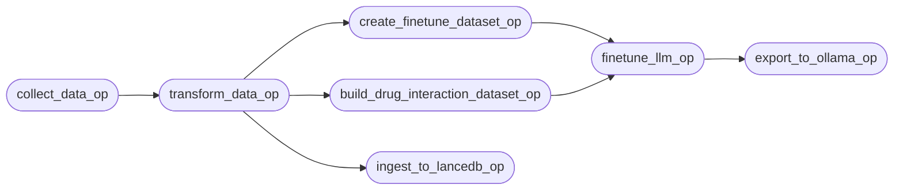
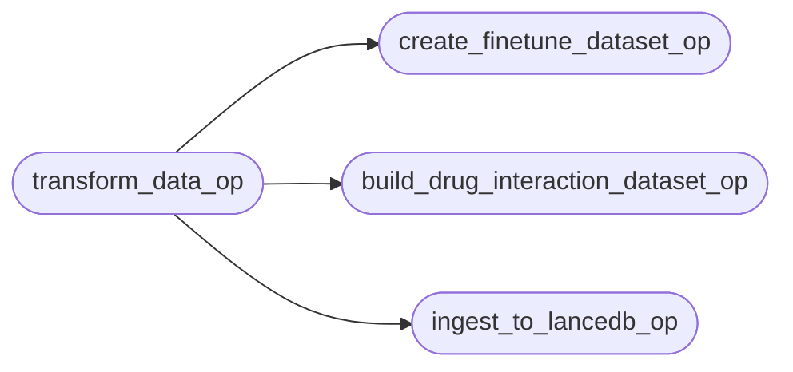
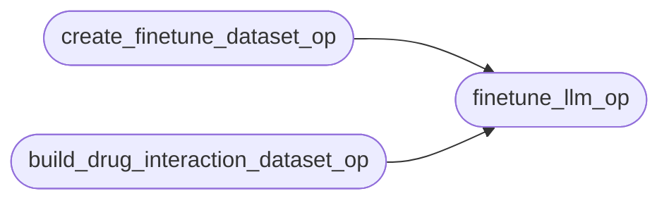
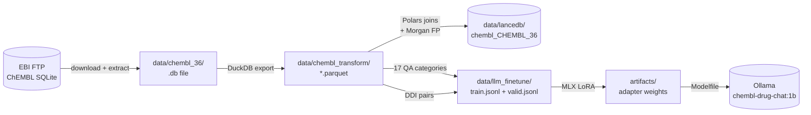

# ChEMBL MLOps Pipeline

Orchestrated with [Dagster](https://dagster.io). The pipeline downloads ChEMBL, transforms it into Parquet, builds training datasets and a vector store in parallel, fine-tunes Gemma 3, and exports the model to Ollama.

---

## Quick Start

```bash
# Start the Dagster UI (http://localhost:3000)
dagster dev -w deployments/workspace.yaml

# Run the full pipeline headlessly
uv run python -m app.orchestration.data_transformation
```

---

## Full Pipeline



> `ingest_to_lancedb_op` runs in parallel with the two dataset builders and has no downstream dependencies in the current pipeline — the vector store is ready for inference as soon as it completes.

---

## Stages

### Stage 1 — `collect_data_op`

| Property | Detail |
|---|---|
| Module | `app.scripts.flows.initial_data_transformation.collect_data` |
| Input | ChEMBL version string (default `"36"`) via `ChemblConfig` |
| Output | `data/chembl_36_sqlite.tar.gz` → extracted SQLite DB |
| What it does | Streams the ChEMBL SQLite archive from the EBI FTP server and extracts it locally |
| Typical duration | ~5–10 min (3.5 GB download) |

---

### Stage 2 — `transform_data_op`

| Property | Detail |
|---|---|
| Module | `app.scripts.flows.initial_data_transformation.transform_data` |
| Depends on | `collect_data_op` |
| Output | `data/chembl_transform/*.parquet` (one file per table) |
| What it does | Attaches the SQLite DB via DuckDB, exports every non-empty table to Parquet |
| Typical duration | ~2–5 min |

---

### Stage 3 — Fan-out (three ops run in parallel)



#### `create_finetune_dataset_op`

| Property | Detail |
|---|---|
| Module | `app.scripts.flows.llm_finetuning_data.build_finetune_dataset` |
| Output | `data/llm_finetune/train.jsonl`, `data/llm_finetune/valid.jsonl` (90/10 split) |
| What it does | Generates 17 categories of QA pairs from ChEMBL (mechanisms, indications, metabolism, DDIs, bioactivity, warnings, synonyms, physicochemical props, ATC, products, literature, assays, ligand efficiency, sequences, protein families, biotherapeutics, target relations) |

#### `build_drug_interaction_dataset_op`

| Property | Detail |
|---|---|
| Module | `app.scripts.flows.llm_finetuning_data.build_drug_interaction_dataset` |
| Output | Drug-interaction JSONL for fine-tuning |
| What it does | Builds targeted drug-drug interaction training pairs from shared CYP substrates and ChEMBL activity data |

#### `ingest_to_lancedb_op`

| Property | Detail |
|---|---|
| Module | `app.scripts.flows.vector_store.ingest_to_lancedb` |
| Output | `data/lancedb/chembl_CHEMBL_36/` LanceDB table |
| What it does | Joins 13 ChEMBL Parquet tables into one flat Polars DataFrame, computes 2048-bit Morgan fingerprint vectors (`rdFingerprintGenerator`), and streams ~2.85 M compound rows to LanceDB in batches |
| Typical duration | ~6 min (ThreadPoolExecutor pipeline, 2× speedup vs sequential) |
| See also | [`app/scripts/flows/vector_store/README.md`](../scripts/flows/vector_store/README.md) |

---

### Stage 4 — `finetune_llm_op` (fan-in)



| Property | Detail |
|---|---|
| Module | `app.scripts.flows.finetuning.finetuning` |
| Depends on | Both `create_finetune_dataset_op` **and** `build_drug_interaction_dataset_op` (fan-in) |
| What it does | Fine-tunes `google/gemma-3-1b-pt` with LoRA via MLX on the generated JSONL datasets |
| Config | `BATCH_SIZE=4`, `NUM_LAYERS=16`, `ITERS=1500`, `LR=1e-5`, `MAX_SEQ_LEN=2048` |
| Output | `artifacts/<timestamp>/` — adapter weights + fused model |
| Typical duration | ~45–90 min (Apple Silicon M1 Pro / 32 GB) |

---

### Stage 5 — `export_to_ollama_op`

| Property | Detail |
|---|---|
| Module | `app.scripts.flows.finetuning.export_to_ollama` |
| Depends on | `finetune_llm_op` |
| What it does | Registers the latest fine-tuned LoRA adapter with Ollama as `chembl-drug-chat:1b` |
| After export | `ollama run chembl-drug-chat:1b` |

---

## Configuration

The `ChemblConfig` class lets you override the ChEMBL version at run time:

```python
class ChemblConfig(Config):
    chembl_version: str = "36"
```

In the Dagster UI, pass config when launching a run:

```yaml
ops:
  collect_data_op:
    config:
      chembl_version: "36"
  transform_data_op:
    config:
      chembl_version: "36"
```

---

## Schedule

The pipeline runs daily at midnight UTC:

```python
daily_schedule = ScheduleDefinition(
    job=chembl_pipeline,
    cron_schedule="0 0 * * *",
    execution_timezone="UTC",
)
```

---

## Data Flow



---

## Workspace

Defined in `deployments/workspace.yaml`:

```yaml
load_from:
  - python_module:
      module_name: app.orchestration.data_transformation
      attribute: defs
```

All ops, jobs, and schedules are exported through the `defs` object.

---

## Tradeoffs

| Decision | Alternative | Reason |
|---|---|---|
| `ingest_to_lancedb_op` runs in parallel with dataset builders | Sequential after transform | No data dependency; ~6 min overlap saves wall-clock time |
| LanceDB ingest is independent of fine-tuning | Block finetuning on ingest | Vector store is for inference, not training; no coupling needed |
| Fan-in before finetuning | Start finetuning on first dataset ready | MLX training needs both datasets to produce a balanced model |
| Daily schedule at midnight UTC | On-demand only | ChEMBL releases are periodic; overnight run avoids peak hours |
| `ChemblConfig` version param on collect + transform | Hard-coded version | Allows safe re-runs against a future ChEMBL release without code changes |
