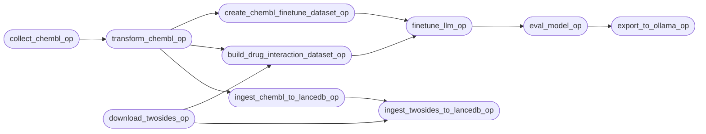
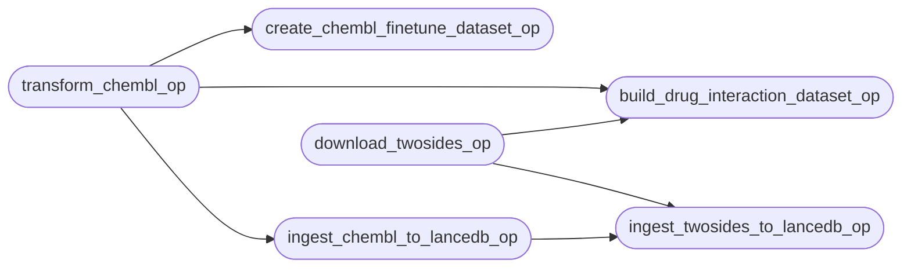
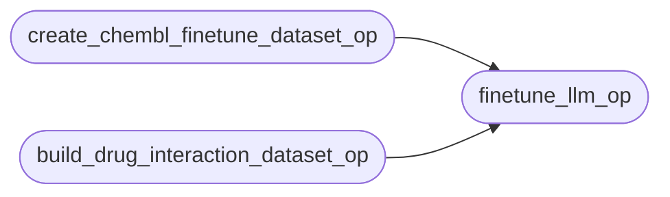
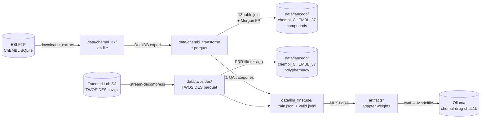

# ChEMBL MLOps Pipeline

Orchestrated with [Dagster](https://dagster.io). The pipeline downloads ChEMBL and TWOSIDES, transforms them into Parquet, builds training datasets and a vector store in parallel, fine-tunes Gemma 3, evaluates the model, and exports it to Ollama.

---

## Quick Start

```bash
# Start the Dagster UI (http://localhost:3000)
dagster dev -w deployments/workspace.yaml

# Run the full pipeline headlessly
uv run python -m app.orchestration.data_transformation
```

---

## Full Pipeline



> `download_twosides_op` starts immediately in parallel with `collect_chembl_op` — it has no dependency on ChEMBL data.
>
> `ingest_chembl_to_lancedb_op` and `finetune_llm_op` run in parallel after `transform_chembl_op` — the vector store and the fine-tuning have no data dependency on each other.

---

## Stages

### Stage 1 — `collect_chembl_op`

| Property | Detail |
|---|---|
| Module | `app.scripts.flows.initial_data_transformation.collect_data` |
| Input | ChEMBL version string (default `"37"`) via `ChemblConfig` |
| Output | `data/chembl_37_sqlite.tar.gz` → extracted SQLite DB |
| What it does | Streams the ChEMBL SQLite archive from the EBI FTP server and extracts it locally |
| Typical duration | ~5–10 min (5.6 GB download) |

---

### Stage 1 (parallel) — `download_twosides_op`

| Property | Detail |
|---|---|
| Module | `app.scripts.flows.llm_finetuning_data.download_twosides` |
| Input | None (independent of ChEMBL) |
| Output | `data/twosides/TWOSIDES.parquet` (~50 MB) |
| What it does | Streams TWOSIDES.csv.gz from Tatonetti Lab S3, decompresses in memory, filters the embedded duplicate header row, casts numeric columns, writes Parquet |
| Typical duration | ~2–3 min |

---

### Stage 2 — `transform_chembl_op`

| Property | Detail |
|---|---|
| Module | `app.scripts.flows.initial_data_transformation.transform_data` |
| Depends on | `collect_chembl_op` |
| Output | `data/chembl_transform/*.parquet` (one file per table) |
| What it does | Attaches the SQLite DB via DuckDB, exports every non-empty table to Parquet |
| Typical duration | ~2–5 min |

---

### Stage 3 — Fan-out (four ops run in parallel)



#### `create_chembl_finetune_dataset_op`

| Property | Detail |
|---|---|
| Module | `app.scripts.flows.llm_finetuning_data.build_finetune_dataset` |
| Output | `data/llm_finetune/train.jsonl`, `data/llm_finetune/valid.jsonl` (90/10 split) |
| What it does | Generates activity-based QA pairs from ChEMBL |

#### `build_drug_interaction_dataset_op`

| Property | Detail |
|---|---|
| Module | `app.scripts.flows.llm_finetuning_data.build_drug_interaction_dataset` |
| Depends on | `transform_chembl_op` **and** `download_twosides_op` (fan-in) |
| Output | Appends 21-category QA pairs to `data/llm_finetune/` |
| What it does | Builds drug-drug interaction, mechanism, indication, polypharmacy (TWOSIDES), and 17 other QA categories from ChEMBL + TWOSIDES |

#### `ingest_chembl_to_lancedb_op`

| Property | Detail |
|---|---|
| Module | `app.scripts.flows.vector_store.ingest_to_lancedb` |
| Output | `data/lancedb/chembl_CHEMBL_37/` — `compounds` table |
| What it does | Joins 13 ChEMBL Parquet tables, computes 2048-bit Morgan fingerprint vectors, streams ~2.85 M compound rows to LanceDB in batches |
| Typical duration | ~6 min |
| See also | [`app/scripts/flows/vector_store/README.md`](../scripts/flows/vector_store/README.md) |

#### `ingest_twosides_to_lancedb_op`

| Property | Detail |
|---|---|
| Module | `app.scripts.flows.vector_store.ingest_twosides_to_lancedb` |
| Depends on | `ingest_chembl_to_lancedb_op` **and** `download_twosides_op` (fan-in) |
| Output | `data/lancedb/chembl_CHEMBL_37/` — `polypharmacy` table |
| What it does | Filters TWOSIDES Parquet (PRR ≥ 3.0, cases ≥ 5), aggregates to one row per drug pair, writes scalar-indexed `polypharmacy` table |
| Typical duration | ~1 min |

---

### Stage 4 — `finetune_llm_op` (fan-in)



| Property | Detail |
|---|---|
| Module | `app.scripts.flows.finetuning.finetuning` |
| Depends on | Both dataset ops (fan-in) |
| What it does | Fine-tunes `google/gemma-3-1b-pt` with LoRA via MLX |
| Config | `BATCH_SIZE=4`, `NUM_LAYERS=16`, `ITERS=1500`, `LR=1e-5`, `MAX_SEQ_LEN=2048` |
| Output | `artifacts/<timestamp>/` — adapter weights |
| Typical duration | ~45–90 min (Apple Silicon M1 Pro / 32 GB) |

---

### Stage 5 — `eval_model_op`

| Property | Detail |
|---|---|
| Module | `app.scripts.flows.eval.eval_model` |
| Depends on | `finetune_llm_op` |
| What it does | Runs perplexity eval on `valid.jsonl` and scores against the golden pharmacology benchmark; gates export on result |
| Output | `artifacts/<timestamp>/eval_results.json` |

---

### Stage 6 — `export_to_ollama_op`

| Property | Detail |
|---|---|
| Module | `app.scripts.flows.finetuning.export_to_ollama` |
| Depends on | `eval_model_op` |
| What it does | Fuses the LoRA adapter, converts to GGUF, writes a Modelfile with the correct `### Question / ### Answer` template, and runs `ollama create chembl-drug-chat:1b` |
| After export | `ollama run chembl-drug-chat:1b` |

---

## Configuration

```python
class ChemblConfig(Config):
    chembl_version: str = "37"
```

In the Dagster UI, pass config when launching a run:

```yaml
ops:
  collect_chembl_op:
    config:
      chembl_version: "37"
  transform_chembl_op:
    config:
      chembl_version: "37"
```

---

## Schedule

The pipeline runs daily at midnight UTC:

```python
daily_schedule = ScheduleDefinition(
    job=chembl_pipeline,
    cron_schedule="0 0 * * *",
    execution_timezone="UTC",
)
```

---

## Data Flow



---

## Workspace

Defined in `deployments/workspace.yaml`:

```yaml
load_from:
  - python_module:
      module_name: app.orchestration.data_transformation
      attribute: defs
```

All ops, jobs, and schedules are exported through the `defs` object.

---

## Tradeoffs

| Decision | Alternative | Reason |
|---|---|---|
| `download_twosides_op` starts immediately | Wait for ChEMBL collect | TWOSIDES is independent; starting in parallel saves ~3 min |
| `ingest_chembl_to_lancedb_op` runs in parallel with dataset builders | Sequential after transform | No data dependency; ~6 min overlap saves wall-clock time |
| `ingest_twosides_to_lancedb_op` fan-in from both ChEMBL LanceDB + TWOSIDES | After ChEMBL only | Needs the ChEMBL DB to exist (same LanceDB dir) and the TWOSIDES Parquet to be ready |
| Fan-in before finetuning | Start finetuning on first dataset ready | MLX training needs both datasets for a balanced model |
| `eval_model_op` gates export | Export unconditionally | Prevents a regressed model from overwriting a good one |
| Daily schedule at midnight UTC | On-demand only | ChEMBL releases are periodic; overnight run avoids peak hours |
