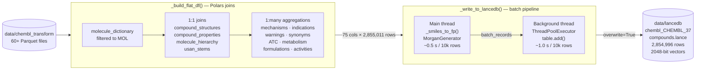

# ChEMBL → LanceDB Vector Store

This module ingests all ChEMBL compound data into a LanceDB vector store for
Retrieval-Augmented Generation (RAG) at inference time — replacing the
hallucination-prone fine-tuning approach with grounded, lookup-based answers.

---

## Why RAG instead of fine-tuning?

Fine-tuning teaches a model to *sound like* a domain expert. It does not give
the model access to ground truth records. When asked "what are the known
metabolic enzymes for ibuprofen?", a fine-tuned model will generate a
plausible-sounding answer that may be subtly wrong.

RAG solves this by:

1. Converting the query molecule into a fingerprint vector
2. Finding the most similar compound in the vector store (nearest-neighbour search)
3. Injecting the retrieved record — indications, mechanisms, warnings, etc. —
   directly into the prompt as context
4. Letting the model *format* the answer, not *remember* it

The model can no longer hallucinate facts it was never trained on; it can only
rephrase what the vector store retrieved.

---

## Architecture



> The pipeline **always overwrites** an existing table — re-runs are safe and idempotent.
>
> The ThreadPoolExecutor pipeline overlaps fingerprinting of batch N+1 with the LanceDB write of batch N, hiding ~0.5 s of I/O per batch (2× end-to-end speedup).

---

## Building the flat table

LanceDB is **not relational** — it has no JOIN engine. All joins must be
pre-computed before writing. `_build_flat_df()` does this in two stages:

### Stage 1 — 1:1 joins (on `molregno`)

| Table | Columns added |
|---|---|
| `compound_structures` | `canonical_smiles`, `standard_inchi_key` |
| `compound_properties` | `mw_freebase`, `alogp`, `hba`, `hbd`, `psa`, `qed_weighted`, `full_molformula`, `num_ro5_violations`, `heavy_atoms` |
| `molecule_hierarchy` | `parent_molregno`, `active_molregno` |
| `usan_stems` | `usan_stem_annotation`, `usan_stem_class` |

These are true 1:1 relationships — one property row per compound — so they
expand the column count without multiplying rows.

### Stage 2 — 1:many aggregations (grouped back to `molregno`)

| Source | Aggregated columns |
|---|---|
| `drug_mechanism` + `target_dictionary` | `mechanisms`, `action_types`, `mechanism_targets` |
| `drug_indication` | `indications`, `indication_efo_terms`, `max_indication_phase` |
| `drug_warning` | `warning_types`, `warning_classes`, `warning_descriptions`, `warning_countries`, `first_warning_year` |
| `molecule_synonyms` | `synonyms` |
| `molecule_atc_classification` + `atc_classification` | `atc_codes`, `atc_who_names`, `atc_level1–4` |
| `metabolism` + `compound_records` | `metabolic_enzymes`, `metabolic_conversions` |
| `formulations` + `products` | `trade_names`, `routes`, `dosage_forms` |
| `compound_structural_alerts` + `structural_alerts` + `structural_alert_sets` | `structural_alerts`, `structural_alert_sets` |
| `molecule_atc_classification` + `defined_daily_dose` | `defined_daily_doses`, `ddd_routes` |
| `activities` + `assays` + `target_dictionary` | `max_pchembl`, `mean_pchembl`, `activity_count`, `activity_types`, `activity_targets` |

Multiple values per compound (e.g. several indications) are joined with `"; "`.
The 24.2M-row `activities` table is kept fully lazy until the final `.agg()` to
avoid materialising it in memory.

Rows without a `canonical_smiles` are dropped — no SMILES means no fingerprint
and no vector search is possible.

---

## Fingerprinting

Each compound is represented as a **2048-bit Morgan fingerprint** (radius 2,
equivalent to ECFP4). This encodes the local chemical environment of each atom
out to two bonds — proven to correlate well with biological activity and widely
used for similarity search.

### API choice: `rdFingerprintGenerator` vs deprecated `rdMolDescriptors`

RDKit's new `MorganGenerator` API (available since 2022, the old API deprecated
as of 2026) is significantly faster:

| API | Single-thread | 8 processes | Notes |
|---|---|---|---|
| `GetMorganFingerprintAsBitVect` | 1,655 mol/s | 6,560 mol/s | Extra `np.array()` conversion |
| `MorganGenerator.GetFingerprintAsNumPy` | **17,982 mol/s** | 18,951 mol/s | Returns NumPy array directly |

Key observations:
- The new API is **~10× faster** single-threaded due to direct NumPy output
- `ProcessPoolExecutor` adds almost no benefit with the new API (1.1× vs 4.0×
  with the old one) because the bottleneck shifts from CPU to process-spawn and
  IPC overhead
- **`ProcessPoolExecutor` was removed** — the new API is faster single-threaded
  than the old one with 8 workers

The generator is created once at module import time (`_FP_GEN`) and reused
across all calls. This avoids per-call re-allocation of the internal C++ object.

---

## Write pipeline

### Why `iter_slices()` instead of `to_dicts()`

`to_dicts()` materialises the entire 2.85M-row DataFrame as Python dicts in RAM
before any writing starts — roughly 3–4 GB at peak. `iter_slices(BATCH_SIZE)`
yields 10,000-row slices lazily, keeping peak memory to one batch at a time
(~30 MB).

### ThreadPoolExecutor pipeline

Even with fast fingerprinting (~0.5s / 10k rows), the LanceDB append takes
~1.0s / 10k rows, making I/O the new bottleneck. The pipeline:

```
Batch 1:  [fingerprint]──[write──────]
Batch 2:             [fingerprint]──[write──────]
Batch 3:                         [fingerprint]──[write──────]
```

Fingerprinting of batch N+1 runs in the main thread while batch N is being
written by the background thread, hiding ~0.5s of I/O per batch.

### End-to-end benchmark (10k rows/batch, 10 batches, 8-core Apple Silicon)

| Approach | Time/batch | Throughput | Full run (286 batches) |
|---|---|---|---|
| Old: `ProcessPool` + deprecated API | 2.40s | 4,160 rows/s | ~11.5 min |
| New: `MorganGenerator` + thread pipeline | **1.19s** | **8,400 rows/s** | **~5.7 min** |

**Net: 2.0× end-to-end speedup.**

---

## Tradeoffs

| Decision | Chosen | Alternative | Why |
|---|---|---|---|
| Pre-join all tables | ✅ One flat table | Join at query time | LanceDB has no JOIN engine; pre-joining is the only option |
| Morgan fingerprint | ✅ ECFP4 (2048-bit) | MACCS keys, topological | Best correlation with bioactivity; standard in cheminformatics |
| Fingerprint size | ✅ 2048 bits | 512 / 4096 | 512 loses specificity; 4096 adds 4× vector storage with diminishing returns |
| `MorganGenerator` API | ✅ New (2022+) | `rdMolDescriptors` | 10× faster; returns NumPy directly; no deprecation warnings |
| `ProcessPoolExecutor` | ❌ Removed | Keep for fingerprinting | New API is faster single-threaded than old API with 8 workers; spawn overhead is not worth it |
| `ThreadPoolExecutor` | ✅ 1 write thread | Sync write | Overlaps LanceDB I/O with fingerprinting; GIL released during file I/O |
| Batch size | ✅ 10,000 rows | 1,000 / 100,000 | Balances memory (~30 MB/batch), IPC cost, and LanceDB commit granularity |
| Scalar indices | ✅ `chembl_id`, `standard_inchi_key` | None / more | Enables fast exact-match filtering alongside ANN vector search |

---

## Running the ingest

```bash
# From repo root — uses default paths (data/chembl_transform → data/lancedb)
uv run python app/scripts/flows/vector_store/ingest_to_lancedb.py
```

Or from Python:

```python
from app.scripts.flows.vector_store.ingest_to_lancedb import ingest_compounds_to_lancedb

ingest_compounds_to_lancedb(
    parquet_dir="data/chembl_transform",
    lancedb_dir="data/lancedb",
)
```

Expected output:

```
[ingest] ChEMBL version: CHEMBL_36
[ingest] Flat DataFrame: 75 columns, 2,855,011 rows
Writing batches: 100%|██████████| 286/286 [05:42<00:00, 1.20s/it, written=2,854,996, skipped=15]
[ingest] Done. 2,854,996 compounds written (15 skipped — invalid SMILES).
```

Re-running is safe — an existing table is overwritten automatically.

---

## Querying the vector store

```python
import numpy as np
import lancedb
from rdkit import Chem
from app.scripts.flows.vector_store.ingest_to_lancedb import _FP_GEN, LANCEDB_DIR

db = lancedb.connect(f"{LANCEDB_DIR}/chembl_CHEMBL_37")
table = db.open_table("compounds")

# Similarity search by SMILES
query_smiles = "CC(=O)Oc1ccccc1C(=O)O"  # aspirin
mol = Chem.MolFromSmiles(query_smiles)
query_vector = _FP_GEN.GetFingerprintAsNumPy(mol).astype(np.float32).tolist()

results = (
    table.search(query_vector)
         .limit(5)
         .to_pandas()
)

# Exact lookup by ChEMBL ID
results = (
    table.search(query_vector)
         .where("chembl_id = 'CHEMBL25'")
         .limit(1)
         .to_pandas()
)
```

---

## Tests

```bash
uv run pytest app/tests/flows/ingest_to_lancedb_test.py -v
```

29 tests covering `_collect`, `_smiles_to_fp`, `_resolve_chembl_version`,
`_build_flat_df`, `_write_to_lancedb`, and `ingest_compounds_to_lancedb`.
All tests use isolated `tmp_path` directories and minimal stub parquet files —
no dependency on real ChEMBL data.
