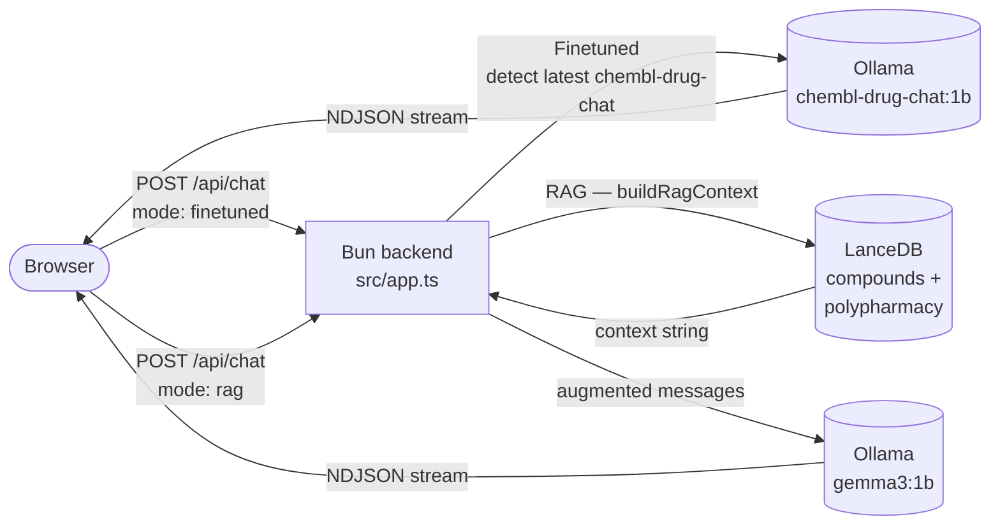

# Bun Web App

A streaming chat interface that serves the fine-tuned and RAG models **side by side**, so you can compare their answers on the same question simultaneously.

```
┌─────────────────────────────────────────────────────┐
│  Chem MLOps Chat                  chembl-drug-chat  │
├──────────────────────────┬──────────────────────────┤
│  Finetuned               │  RAG                     │
│  chembl-drug-chat:1b     │  gemma3:1b               │
│                          │                          │
│  [streamed response...]  │  [streamed response...]  │
│                          │                          │
├──────────────────────────┴──────────────────────────┤
│  Message both models...                      [Send] │
└─────────────────────────────────────────────────────┘
```

Sending a message fires both requests in parallel. Responses stream token-by-token from Ollama and render as markdown. Each pane keeps its own independent conversation history.

---

## Modes

| Pane | Model | How it works |
|------|-------|-------------|
| **Finetuned** | `chembl-drug-chat:1b` | LoRA-tuned Gemma 3 1B; domain-aware and fast |
| **RAG** | `gemma3:1b` (base) | LanceDB context injected as system message; grounded in live ChEMBL + TWOSIDES records |

---

## Folder structure

```
web/
├── public/
│   ├── index.html          # Dual-pane layout (Finetuned | RAG)
│   ├── style.css
│   └── frontend.js         # Bundled from src/frontend.ts at server startup
├── src/
│   ├── app.ts              # Request handler, Ollama streaming proxy, model detection
│   ├── rag.ts              # extractDrugCandidates, buildRagContext, augmentMessages
│   ├── frontend.ts         # Parallel streaming, per-pane history, markdown rendering
│   └── frontend-helpers.ts # renderMarkdown, formatReplyText (no DOM deps, testable)
├── test/
│   ├── app.test.ts         # Handler routing, streaming, model detection, RAG model selection
│   ├── rag.test.ts         # extractDrugCandidates, augmentMessages, buildRagContext
│   ├── chat.test.ts        # normalizeMessages
│   ├── frontend.test.ts    # renderMarkdown, formatReplyText
│   └── model.test.ts       # pickLatestModel
├── package.json
├── .env                    # Working defaults — loaded automatically by Bun
└── server.ts               # Bun.serve entry point + frontend bundle step
```

---

## How it works



### `server.ts`

- Bundles `src/frontend.ts` into `public/frontend.js` via `Bun.build` at startup
- Starts `Bun.serve` on port `3000`

### `src/app.ts`

- Normalises and validates incoming chat messages
- Detects the latest `chembl-drug-chat:*` Ollama model (cached 15 s)
- Routes `mode: "finetuned"` → fine-tuned model
- Routes `mode: "rag"` → `buildRagContext` → `augmentMessages` → base `gemma3:1b`
- Proxies the Ollama NDJSON stream through a `TransformStream` that snoops the final `done: true` chunk to log token counts and latency
- Returns `x-model` / `x-source` headers alongside the streamed body
- Serves static files, `/api/health`, and `/api/model` (returns both finetuned and RAG model names)

### `src/rag.ts`

- `extractDrugCandidates(text)` — regex extracts capitalised words, filters a stopword list, title-cases to match DB format
- `buildRagContext(message, lancedbDir)` — queries `compounds` by name and `polypharmacy` for pair signals and top per-drug partners; returns a bullet-list context string or `null` if nothing is found
- `augmentMessages(messages, context)` — prepends `{ role: "system", content: context }` to the history

### `src/frontend.ts`

- Holds two independent `histories` (`finetuned` and `rag`)
- On submit: adds user bubble to both panes, fires both fetches with `Promise.all`, streams each response independently with `Promise.allSettled`
- During streaming: `textContent` is updated chunk-by-chunk for live output
- On stream end: switches to `innerHTML = renderMarkdown(accumulated)` for formatted display
- Pane headers show the live model name fetched from `/api/model`

### `src/frontend-helpers.ts`

- `renderMarkdown(text)` — escapes HTML then applies regex transforms for code blocks, inline code, bold, italic, and newlines; no dependency added
- `formatReplyText(reply)` — falls back to `"(empty response)"` when the model returns blank

---

## Run the app

```bash
# Dev mode — hot reload
cd web
bun run dev

# Production
cd web
bun run start
```

Open [http://localhost:3000](http://localhost:3000).

---

## Tests

```bash
cd web
bun test
```

---

## Required services

Both Ollama models must be available before starting the server:

```bash
ollama serve
ollama list | grep -E "chembl-drug-chat|gemma3"
```

The finetuned pane uses the newest `chembl-drug-chat:*` tag. The RAG pane uses `gemma3:1b` (or whatever `RAG_MODEL_NAME` is set to in `.env`).

---

## Environment variables

`web/.env` is committed with working defaults — Bun loads it automatically:

```bash
PORT=3000
OLLAMA_BASE_URL=http://127.0.0.1:11434
OLLAMA_MODEL_PREFIX=chembl-drug-chat
OLLAMA_MODEL_NAME=chembl-drug-chat:1b   # fallback if /api/tags is unreachable
RAG_MODEL_NAME=gemma3:1b                # model used in the RAG pane
# LANCEDB_DIR=                          # default: auto-resolved from web/src/rag.ts
```

---

## Observability

Each inference request logs a JSON line to stdout:

```json
{"ts":"...","model":"chembl-drug-chat:1b","source":"ollama-tags","latencyMs":342,"promptTokens":61,"completionTokens":87,"evalDurationMs":2445,"totalDurationMs":5589}
```

Fields come from the Ollama `done: true` chunk and wall-clock time around the request. Pipe to `jq` or any log aggregator.
