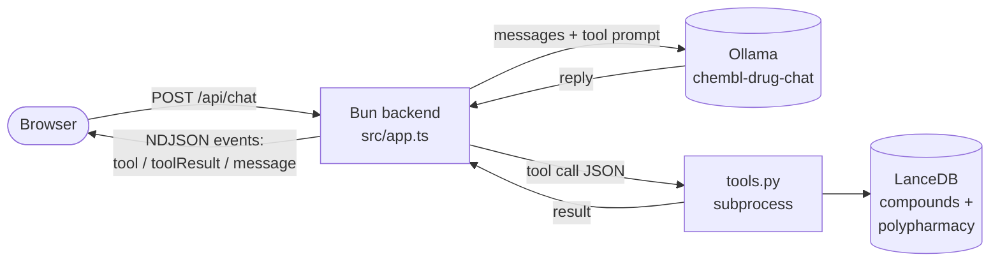

# Bun Web App

A single-pane chat interface where the fine-tuned model answers with **tools**: it
asks for a ChEMBL or TWOSIDES lookup, the server runs it, and the result comes back
into the conversation. Nothing is injected unless a tool asked for it.

```
┌─────────────────────────────────────────────────────┐
│  Chem MLOps Chat        chembl-drug-chat:1b · tags  │
├─────────────────────────────────────────────────────┤
│                    What is the MW of Aspirin?  [me] │
│                                                     │
│  get_compound_by_name({"name":"Aspirin"})           │
│  {"chembl_id":"CHEMBL25","mw_freebase":180.16,...}  │
│                                                     │
│  Aspirin (CHEMBL25) has a molecular weight of       │
│  180.16, formula C9H8O4.                            │
├─────────────────────────────────────────────────────┤
│  Ask about a drug, an interaction, or a structure…  │
└─────────────────────────────────────────────────────┘
```

---

## Tools

| Tool | Arguments | Backed by |
|------|-----------|-----------|
| `get_compound_by_name` | `{"name": "Aspirin"}` | LanceDB `compounds` |
| `query_drug_side_effects` | `{"drug_name": "Warfarin", "n": 10}` | LanceDB `polypharmacy` (TWOSIDES) |
| `query_polypharmacy` | `{"drug_1": "Warfarin", "drug_2": "Aspirin"}` | LanceDB `polypharmacy` |
| `query_compounds` | `{"smiles": "CCO", "n": 5}` | Morgan-fingerprint similarity search |
| `draw_molecule` | `{"name": "Ibuprofen"}` | ChEMBL `canonical_smiles` → RDKit `Draw.MolToImage` → PNG data URL |

The first four are the existing functions in
`app/scripts/flows/vector_store/query_lancedb.py`, reached through the
`app.scripts.flows.vector_store.tools` CLI — one subprocess per call.

`draw_molecule` takes a **name**, not a SMILES: models invent SMILES strings that
parse but draw the wrong molecule. The structure comes from the `compounds`
table, and a name mistakenly passed in the `smiles` field is retried as a lookup.
A SMILES is only drawn as given when the user supplied one, and the result says
which (`source: ChEMBL` or `supplied by the user`).

### Temporary: the draw bridge

`routeDirectToolCall` in `src/tools.ts` routes an explicit "draw X" / "show me
the structure of X" straight to `draw_molecule`, and captions it from the tool
result with `describeDrawResult` — the model gets no turn at all. This is **not
the model calling a tool**: handed a tool result, `chembl-drug-chat:1b` mimics
its JSON shape rather than reading it (real captures: `{ CHEMBL1201082 }`, and
an invented ebi.ac.uk image URL). Delete both functions and their call sites in
`app.ts` once a fine-tune trained on the dataset's "tool calls" category does
the routing itself. Every other question still goes to the model.

### Tool calls are prompted, not native

Ollama refuses its `tools` field for this model (`does not support tools` — Gemma 3
has no tool template), so the system prompt asks for a bare JSON object and
`parseToolCall` digs it out of the reply. The current fine-tune is trained to
complete prose and mostly ignores that instruction: the loop works, the model is
not yet a reliable caller. Teaching it is roadmap item 3.

---

## In-app manual

The page carries its own manual: a collapsed **"What can I ask?"** panel above
the chat, listing every tool with a clickable example that fills the input.
It is rendered from `TOOL_SPECS` in `src/tools.ts`, so adding a tool adds a row
— there is no second list to keep in sync. Each spec carries `description`
(written for the model, goes in the system prompt) and optionally `help`
(written for a person, shown in the manual) for the cases where those differ.

A test asserts each example actually reaches the tool it advertises: the draw
phrasing through the bridge, the rest left for the model to decide.

---

## Folder structure

```
web/
├── public/
│   ├── index.html          # Single-pane layout + manual container
│   ├── style.css
│   └── frontend.js         # Bundled from src/frontend.ts at server startup
├── src/
│   ├── app.ts              # Request handler, agent loop, model detection
│   ├── tools.ts            # Tool specs, system prompt, parseToolCall, runTool
│   ├── frontend.ts         # NDJSON event rendering, history, markdown
│   └── frontend-helpers.ts # renderMarkdown, formatReplyText (no DOM deps, testable)
├── test/
│   ├── app.test.ts         # Handler routing, agent loop, step cap, model detection
│   ├── tools.test.ts       # parseToolCall, formatToolResult, prompt/spec agreement
│   ├── chat.test.ts        # normalizeMessages
│   ├── frontend.test.ts    # renderMarkdown, formatReplyText
│   └── model.test.ts       # pickLatestModel
├── package.json
├── .env                    # Working defaults — loaded automatically by Bun
└── server.ts               # Bun.serve entry point + frontend bundle step
```

---

## How it works


```mermaid
flowchart LR
    BR([Browser]) -->|POST /api/chat| BUN[Bun backend\nsrc/app.ts]
    BUN -->|messages + tool prompt| OLL[(Ollama\nchembl-drug-chat)]
    OLL -->|reply| BUN
    BUN -->|tool call JSON| PY[tools.py\nsubprocess]
    PY --> LDB[(LanceDB\ncompounds +\npolypharmacy)]
    PY -->|result| BUN
    BUN -->|NDJSON events:\ntool / toolResult / message| BR
```

### `server.ts`

- Bundles `src/frontend.ts` into `public/frontend.js` via `Bun.build` at startup
- Starts `Bun.serve` on port `3000` with `idleTimeout: 255` — a tool loop makes
  several model calls and the 10 s default cuts the response off

### `src/app.ts`

- Normalises and validates incoming chat messages
- Detects the latest `chembl-drug-chat:*` Ollama model (cached 15 s)
- Agent loop: ask Ollama (non-streaming) → `parseToolCall` → run the tool → append
  `### Tool result` → ask again, up to `maxToolSteps` (default 3)
- Emits NDJSON events as they happen: `{tool}`, `{toolResult}`, `{message}`, `{done}`
- Returns `x-model` / `x-source` headers, and logs one JSON line per request
- Serves static files, `/api/health`, `/api/model`

### `src/tools.ts`

- `TOOL_SPECS` / `TOOL_SYSTEM_PROMPT` — the tool list the model is shown
- `parseToolCall(text)` — first balanced `{…}` in the reply that names a known tool;
  accepts `{tool, args}` and `{name, arguments}`
- `runTool(call)` — spawns `uv run python -m app.scripts.flows.vector_store.tools`
- `formatToolResult(call, outcome)` — truncates to 2000 chars and strips base64
  images (they go to the browser, not the prompt)

### `src/frontend.ts`

- One history, one message feed
- Tool calls render as their own bubble: `name(args)`, then the result — or the
  molecule image when `draw_molecule` returns one
- Errors from the stream replace the pending bubble's contents

### `src/frontend-helpers.ts`

- `renderMarkdown(text)` — escapes HTML then applies regex transforms for code blocks, inline code, bold, italic, and newlines; no dependency added
- `formatReplyText(reply)` — falls back to `"(empty response)"` when the model returns blank

---

## Run the app

```bash
# Dev mode — hot reload
cd web
bun run dev

# Production
cd web
bun run start
```

Open [http://localhost:3000](http://localhost:3000).

---

## Tests

```bash
cd web
bun test
```

---

## Required services

```bash
ollama serve
ollama list | grep chembl-drug-chat
```

Tools need the LanceDB store (`data/lancedb/chembl_CHEMBL_*`) and the project's
Python environment — `uv run` must work from the repo root. A missing table comes
back to the model as an error string, not a crash.

---

## Environment variables

`web/.env` is committed with working defaults — Bun loads it automatically:

```bash
PORT=3000
OLLAMA_BASE_URL=http://127.0.0.1:11434
OLLAMA_MODEL_PREFIX=chembl-drug-chat
OLLAMA_MODEL_NAME=chembl-drug-chat:1b   # fallback if /api/tags is unreachable
```

---

## Observability

Each request logs a JSON line to stdout:

```json
{"ts":"...","model":"chembl-drug-chat:1b","source":"ollama-tags","latencyMs":4210,"toolCalls":1,"promptTokens":612,"completionTokens":87}
```

Token counts are summed over every turn in the loop; `toolCalls` is how many tools
ran. Pipe to `jq` or any log aggregator.
